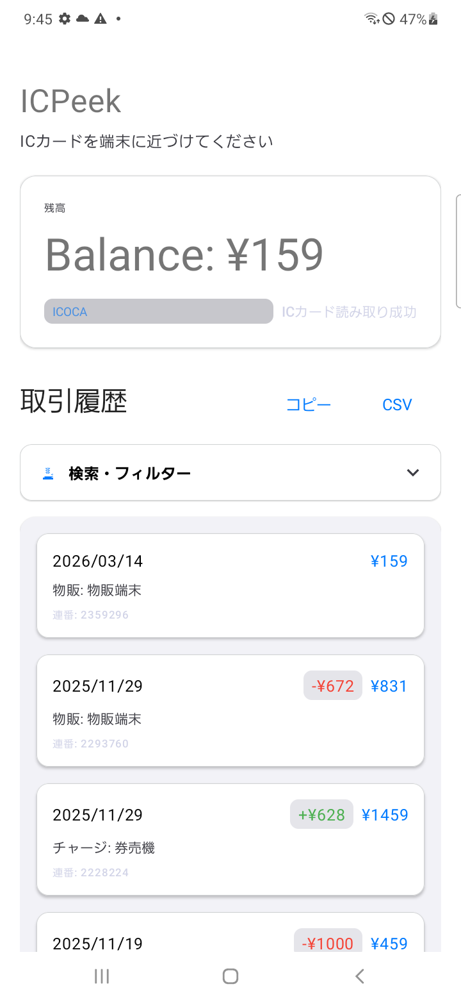
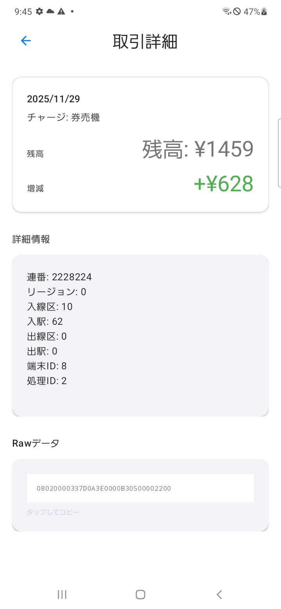

# ICPeek - ICカード残高表示アプリ

FeliCa方式の交通系ICカードの残高と取引履歴をNFCで読み取るAndroidアプリケーション。

## 対応カード

- **ICOCA** - JR西日本
- **Suica** - JR東日本
- **PASMO** - 関東私鉄
- **Edy** - 電子マネー
- **nanaco** - セブン-イレブン
- **WAON** - イオン
- その他FeliCaベースの交通系ICカード

(ICOCAでしかテストできてません、Sorry)

## 🌟 主な機能

### ✅ 基本機能
- **NFCカード検出** - 自動でカードを認識
- **残高表示** - 現在の残高をリアルタイム表示
- **カード種類検出** - カードタイプを自動判定して色分け表示
- **FeliCa通信** - 安定したカードとの通信

### ✅ 取引履歴機能
- **詳細な取引履歴** - 最新の取引を最大10件表示
- **増減額表示** - 取引による増減を色分け（緑：増加、赤：減少）
- **取引タイプ表示** - 物販、乗車、精算などの詳細
- **クリックで詳細** - 取引をタップでRawデータを確認

### ✅ UI/UX
- **クリーンなデザイン** - Material Designベース
- **カード種類別カラー** - ICOCA（青）、Suica/PASMO（緑）など
- **レスポンシブレイアウト** - 画面サイズに最適化
- **日本語対応** - 完全日本語UI

## 📋 動作要件

- **Android端末** - NFC機能搭載
- **Androidバージョン** - API 21 (Android 5.0) 以上
- **FeliCa対応ICカード** - 対応カードをご用意ください

## 🚀 使い方

1. **アプリインストール** - Google PlayまたはAPKからインストール
2. **NFC有効化** - 設定でNFCをオンにする
3. **アプリ起動** - ICPeekを起動
4. **カードタップ** - ICカードを端末のNFCリーダーに近づける
5. **情報表示** - 残高と取引履歴が自動表示

## 📱 画面構成

### メイン画面



### 取引詳細画面



## 🔧 技術仕様

### アーキテクチャ
```
MainActivity
├── NFCReader (NFC通信)
├── TransactionParser (取引解析)
├── CardTypeDetector (カード種類判定)
└── TransactionDetailActivity (詳細画面)
```

### NFC技術
- **インテントフィルタ** - `TECH_DISCOVERED`
- **ターゲット技術** - `android.nfc.tech.NfcF`
- **サービスコード** - `0x090F` (残高読み取り)
- **コマンド** - Read Without Encryption

### データ解析
- **残高抽出** - ブロックデータの10-11バイト目
- **フォーマット** - リトルエンディアン
- **取引履歴** - 16バイトブロックを解析
- **カード種類** - システムコードと製造者IDで判定

## 🛠 開発環境

- **言語** - Kotlin
- **フレームワーク** - Android NFC API
- **UIコンポーネント** - Material Design
- **ビルドツール** - Gradle
- **最小SDK** - 21
- **ターゲットSDK** - 33

## 📦 依存関係

```gradle
implementation 'androidx.core:core-ktx:1.10.1'
implementation 'androidx.appcompat:appcompat:1.6.1'
implementation 'com.google.android.material:material:1.9.0'
implementation 'androidx.constraintlayout:constraintlayout:2.1.4'
implementation 'org.jetbrains.kotlin:kotlin-parcelize-runtime:1.8.22'
```

## 🎯 今後の拡張機能

- [x] **履歴エクスポート** - CSV形式での出力
- [x] **履歴検索機能** - 取引履歴のフィルタリングと検索
- [x] **多言語対応** - 英語、中国語対応

## 📄 ライセンス

[MIT License](LICENSE)

## 🤝 貢献

バグ報告、機能要望、プルリクエストを歓迎します！